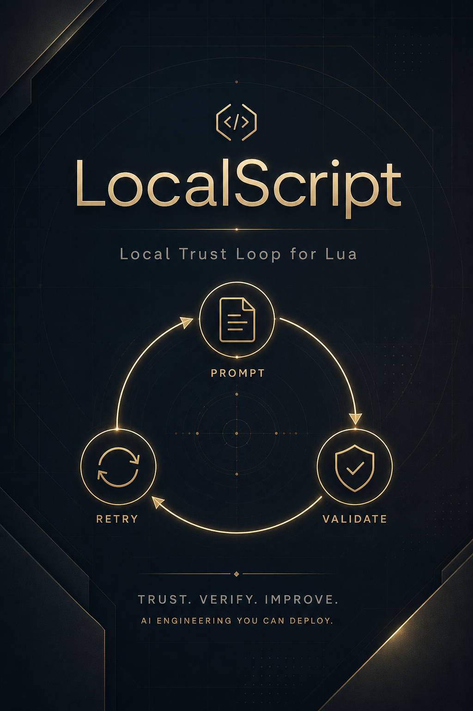

<p align="center">
  
</p>

# LocalScript

**Local trust loop for Lua 5.4** — generate, validate, and repair code on an OpenAI-compatible LLM you control. No required calls to public AI vendors.

LocalScript is a **trust loop for Lua 5.4**: a natural-language task (RU/EN) goes to an **OpenAI-compatible LLM you control** (Ollama, vLLM, LM Studio, …), the service extracts Lua, runs **validators** (StyLua, Selene, LuaLS, `luac`, optional Docker sandbox), and on failure feeds diagnostics back into the model for another pass. There is **no** required dependency on hosted AI vendors (OpenAI, Anthropic, …); inference stays on whatever endpoint you configure.

```text
prompt → local/perimeter LLM → Lua extraction → validators → sandbox → retry → response
```

Two shapes of `POST /generate` on the same engine: compact `{"prompt":"..."}` for “code out”, and `{"task":"...","context":...}` for debugging with steps and validation metadata.

## Quick start

```bash
uv sync --all-extras
cp .env.example .env
uv run localscript-api
```

Open `http://127.0.0.1:8765/docs`, `/ui`, and **`/healthz`**. Configuration uses the `LOCALSCRIPT_` prefix; see [`.env.example`](.env.example).

Example request:

```bash
curl -sS -X POST "http://127.0.0.1:8765/generate" \
  -H "Content-Type: application/json" \
  -d '{"prompt":"Write a Lua 5.4 function factorial(n) for n >= 0"}'
```

## Verify

```bash
uv run ruff check .
uv run pytest -q
PYTHONPATH=. uv run python stands/run_e2e.py
```

Full path (Docker Compose, optional compose smoke, profiles): [`docs/RUNBOOK.md`](docs/RUNBOOK.md).

## Architecture

C4-style overview and diagrams: [`docs/ARCHITECTURE_C4.md`](docs/ARCHITECTURE_C4.md), Mermaid sources: [`docs/c4/README.md`](docs/c4/README.md).

## Privacy and locality

Runtime talks only to the **operator-supplied** OpenAI-compatible base URL. “Local” is a **deployment** property: run Ollama/vLLM/LM Studio in your perimeter. Optional `LOCALSCRIPT_ENFORCE_PRIVATE_HOSTS=true` rejects obvious public hosts and can require an explicit allowlist for internal DNS names (`LOCALSCRIPT_ALLOWED_HOSTS`).

## Repository layout

| Path | Role |
|------|------|
| `localscript/` | LLM client, orchestrator, validation, sandbox, API |
| `stands/` | Mock E2E, benchmark drill (`run_jury_drill.py`), frozen `stands/results/*.compact.json` |
| `docs/` | [Documentation index](docs/README.md) |
| `examples/` | RAG corpus, validation workspace template for Selene/LuaLS |
| `docker/` | API and Lua sandbox images |

## Optional reading

- [`docs/LOCAL_AI_STACK.md`](docs/LOCAL_AI_STACK.md) — optional local embedding/reranker notes  
- [`docs/VLLM_GUIDED.md`](docs/VLLM_GUIDED.md) — guided / structured output on vLLM  

## Origin (experimental)

This project began as a **personal experiment**: pick a real implementation brief from **[MTS True Tech Hack 2026 — tasks](https://truetecharena.ru/contests/true-tech-hack2026#tasks)** and ship a working solution **mostly with AI-assisted workflows** (research, code generation, reviews, and heavy use of automated checks). Official rules and judging criteria live only on the organizer’s site; this repo is an **artifact you can fork**, not a submission package.

The surprising part was **speed**: a full trust loop (LLM → Lua → validators → sandbox → retry) came together **very quickly** even though the author had **essentially no prior Lua** experience. That says more about **clear task framing, good tooling, and verification** than about memorizing a language. Published **as-is** for anyone who finds the pipeline or the experiment useful.

## Why this repo exists (short)

Modern tooling makes it realistic to ship a **small, testable agent loop** with tight feedback: clarify the task, pull the right docs and env knobs, run automated checks, iterate. What moves the needle is **how precisely you ask**, **what context you attach**, and **how you verify**—not raw exposure to every framework. Small teams help when everyone shares pace and intent.

## License and contributing

- [`LICENSE`](LICENSE)  
- [`AUTHORS.md`](AUTHORS.md)  
- [`CONTRIBUTING.md`](CONTRIBUTING.md)  
- [`CHANGELOG.md`](CHANGELOG.md)  

---

**RU:** быстрый старт — выше; приёмка — [`docs/RUNBOOK.md`](docs/RUNBOOK.md); индекс документов — [`docs/README.md`](docs/README.md). Идея репозитория — **эксперимент**: задача с [True Tech Hack 2026](https://truetecharena.ru/contests/true-tech-hack2026#tasks), реализация с опорой на ИИ-инструменты и автопроверки; с Lua до этого практически не работал, срок вышел коротким за счёт постановки задачи и верификации, а не за счёт «знания синтаксиса наизусть».
