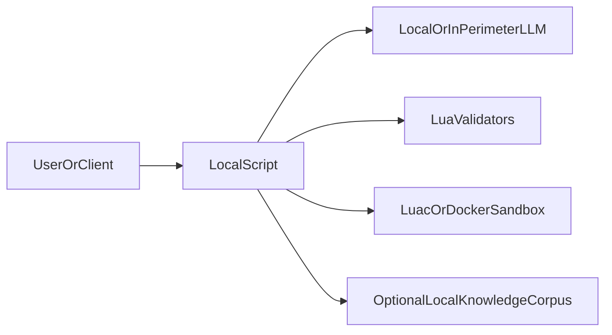
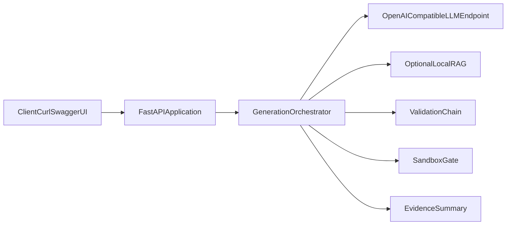
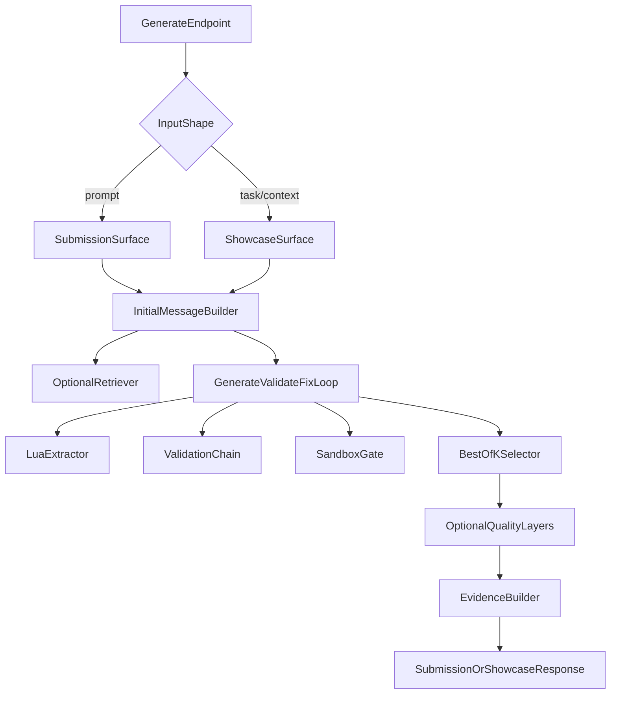

# LocalScript Architecture (C4)

Этот файл — **единый архитектурный reference** для README, сопроводительных материалов и экспорта диаграмм.

Экспортируемые исходники диаграмм лежат в [`c4/README.md`](c4/README.md).

## System Summary

`LocalScript` превращает локальную или in-perimeter LLM в **trust loop для Lua**:

```text
Prompt -> local/in-perimeter LLM -> Lua extraction -> validators -> sandbox -> retry -> response
```

Ключевая идея: ценность дает не один ответ модели, а **контролируемый цикл генерации и проверки**.

## Level 1 - System Context



Interpretation:

- клиент (CLI, UI, автоматизация) взаимодействует только с `LocalScript`
- модель остается локальной или внутри периметра компании
- валидаторы и sandbox образуют доверительную границу вокруг ответа LLM
- локальный knowledge corpus опционален и не покидает тот же контур

## Level 2 - Containers



Containers:

- `FastAPIApplication` — HTTP entrypoint: `/generate`, `/healthz`, `/ui`, OpenAPI
- `GenerationOrchestrator` — prompt assembly, repair loop, candidate selection, final result
- `OpenAICompatibleLLMEndpoint` — Ollama, vLLM, LM Studio или другой operator-controlled endpoint
- `OptionalLocalRAG` — локальный retrieval по корпусу подсказок, stub-файлов и шаблонов
- `ValidationChain` — StyLua, Selene, optional luacheck, LuaLS
- `SandboxGate` — host `luac -p` или Docker sandbox
- `EvidenceSummary` — человекочитаемая сводка о том, что реально проверялось

## Level 3 - Components



Component meaning:

- `GenerateEndpoint` — принимает compact и showcase контракты, но направляет их в один движок
- `InitialMessageBuilder` — собирает system prompt, optional context и optional retrieved references
- `GenerateValidateFixLoop` — основной agent loop: сгенерировать, проверить, вернуть диагностики в следующий шаг
- `LuaExtractor` — извлекает `code` JSON field или fenced Lua block
- `BestOfKSelector` — optional parallel candidates и policy-based winner selection
- `OptionalQualityLayers` — deterministic quality policy и optional LLM judge после успешной генерации
- `EvidenceBuilder` — строит trust/evidence summary для showcase surface

## Level 4 - Runtime Sequence

```mermaid
sequenceDiagram
    participant User
    participant API as FastAPI
    participant Loop as GenerateValidateFixLoop
    participant LLM as OpenAICompatibleLLM
    participant Validators as ValidationChain
    participant Sandbox as SandboxGate

    User->>API: POST /generate
    API->>Loop: build request context
    Loop->>LLM: chat/completions
    LLM-->>Loop: assistant text
    Loop->>Loop: extract Lua
    Loop->>Validators: run static validators
    alt validators pass
        Loop->>Sandbox: run luac or docker sandbox
        alt sandbox pass
            Loop-->>API: success + evidence
            API-->>User: code or showcase response
        else sandbox fails
            Loop->>LLM: diagnostics feedback
        end
    else validators fail
        Loop->>LLM: diagnostics feedback
    end
```

## Trust Boundary And Degraded States

What the architecture guarantees:

- generation and validation are separate concerns
- skipped validators are reported honestly through `validation_profile` and `validation_tools`
- optional layers (`RAG`, `quality_judge`, `best-of-K`) do not replace the default lightweight submission path
- the default lightweight path remains `ollama-8gb`

What it does **not** claim:

- that every runtime profile is equivalent to the `ollama-8gb` reference limits
- that remote/private deployment is enforced by networking policy unless strict perimeter guard is enabled
- that `luac_only` is as strong as Docker sandbox

## Runtime Modes

| Mode | Purpose | Characteristics |
|------|---------|-----------------|
| `submission` surface | минимальный ответ с кодом | `POST /generate` with `prompt`, compact `{code}` response |
| `showcase` surface | демонстрация agent loop | `task/context`, steps, validation metadata, evidence summary |
| `ollama-8gb` profile | эталонный лёгкий профиль | pinned-style limits, `luac_only`, RAG/quality off |
| `qwen7b-local-benchmark` | engineering-max local path | local RAG, Docker sandbox, richer validation |
| `instruct-research` | research ceiling | stronger inference endpoint, same core orchestration |

## Repository Mapping

| Responsibility | Main files |
|----------------|------------|
| HTTP API and surfaces | `localscript/app.py` |
| Core loop and candidate selection | `localscript/orchestrator.py` |
| LLM transport | `localscript/llm.py` |
| Code extraction | `localscript/extract.py` |
| Static validation | `localscript/validate.py` |
| Sandbox execution | `localscript/sandbox.py` |
| Evidence and validation profile | `localscript/validation_report.py` |
| Config and runtime guardrails | `localscript/config.py`, `.env.example` |
| Replayable benchmarks | `stands/run_jury_drill.py`, `stands/results/*.compact.json` |

## Design Principles

- one engine, two response surfaces
- validation is part of the product, not an afterthought
- honest degraded states are better than silent fallback behavior
- optional layers must never obscure the default submission path
- drill profiles are reproducible configurations, not separate product versions
